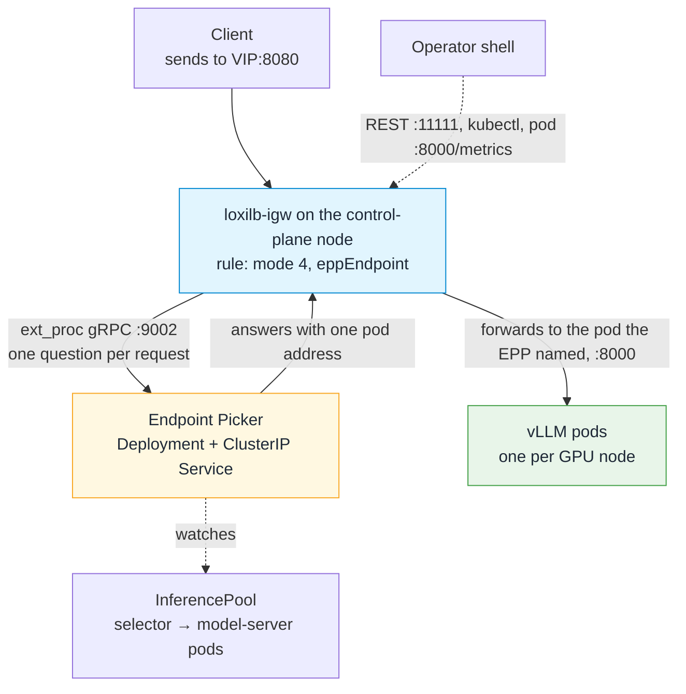

```mermaid
flowchart TD
    C["Client<br/>sends to VIP:8080"] --> G["loxilb-igw on the control-plane node<br/>rule: mode 4, eppEndpoint"]
    G -->|"ext_proc gRPC :9002<br/>one question per request"| E["Endpoint Picker<br/>Deployment + ClusterIP Service"]
    E -.->|"watches"| P["InferencePool<br/>selector → model-server pods"]
    E -->|"answers with one pod address"| G
    G -->|"forwards to the pod the EPP named, :8000"| V["vLLM pods<br/>one per GPU node"]
    O["Operator shell"] -.->|"REST :11111, kubectl, pod :8000/metrics"| G
    style G fill:#e1f5fe,stroke:#0288d1,color:#1f2937
    style E fill:#fff8e1,stroke:#f9a825,color:#1f2937
    style V fill:#e8f5e9,stroke:#43a047,color:#1f2937
```
